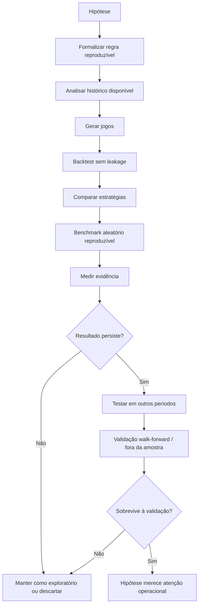

# Loto Lab — mapa mental do projeto

O Loto Lab é um **laboratório reproduzível de hipóteses sobre composição de jogos**.

Ele não existe para “adivinhar dezenas”. O objetivo é transformar uma hipótese em uma regra explícita, executar essa regra por código, testar sem olhar o futuro e medir se o comportamento observado é melhor, pior ou indistinguível de baselines simples e do acaso.

> **Algoritmo calcula; IA interpreta.**

A geração de jogos é uma aplicação das estratégias. O centro intelectual do projeto é o ciclo **hipótese → formalização → teste → evidência → decisão**.

## Visão central



## Mapa do sistema

```mermaid
flowchart TB
    ROOT[LOTO LAB\nLaboratório de estratégias]

    ROOT --> DATA[Dados e histórico]
    ROOT --> ANALYSIS[Análise]
    ROOT --> GENERATION[Geração]
    ROOT --> CHECKER[Conferência]
    ROOT --> BACKTEST[Backtest]
    ROOT --> LAB[Strategy Lab]
    ROOT --> FINANCE[Financeiro]
    ROOT --> ACCESS[Interfaces]
    ROOT --> AI[IA]

    DATA --> CAIXA[API oficial da CAIXA]
    DATA --> SYNC[Bootstrap / sync incremental]
    DATA --> DB[PostgreSQL]
    DATA --> QUALITY[Qualidade do histórico\nlacunas · continuidade · censura]

    ANALYSIS --> WINDOWS[Janelas\nhistórico · ano · mês · 10 · 20]
    ANALYSIS --> SCORE[Score e ranking]
    SCORE --> TIERS[strong · balanced · cold]
    ANALYSIS --> ADV[Análises 2.0]
    ADV --> RANKING[Ranking e sensibilidade]
    ADV --> STRUCTURE[Estrutura]
    ADV --> DYNAMICS[Dinâmica]
    ADV --> COMBINATIONS[Duques / trincas]
    ADV --> VALIDATION[Validação rolling]

    GENERATION --> MEGA[Mega-Sena\n3 fixas + 3 variáveis]
    GENERATION --> LF[Lotofácil\n8–10 fixas + variáveis]
    GENERATION --> DIA[Dia de Sorte\n3 fixas + 4 variáveis]
    GENERATION --> PLAN[Planning\nrestrições · cobertura · auditoria]

    CHECKER --> HITS[Acertos]
    CHECKER --> CORE[Desempenho do núcleo]
    CHECKER --> VARS[Desempenho das variáveis]
    CHECKER --> PRIZES[Faixas de prêmio]

    BACKTEST --> ANTILEAK[Anti-leakage\nconcurso N vê somente < N]
    ANTILEAK --> METRICS[Acertos · prêmio · custo · ROI]

    LAB --> FIXED[Experimentos de núcleo]
    LAB --> RULES[Regras externas]
    LAB --> RANDOM[Controle aleatório reproduzível]
    LAB --> SERIES[Séries por blocos]
    LAB --> COMPARE[Ranking de estratégias]

    FINANCE --> COST[Custo]
    FINANCE --> RETURN[Prêmio / retorno]
    FINANCE --> ROI[ROI / resultado líquido]
    FINANCE --> COVERAGE[Cobertura financeira]

    ACCESS --> WEB[Web]
    ACCESS --> API[API /api/v1]
    ACCESS --> CLI[CLI]

    AI --> EXPLAIN[Explicar resultados]
    AI --> HYPOTHESES[Sugerir hipóteses]
    AI --> COMPAREAI[Comparar evidências]
    AI --> LIMITS[Não inventar dezenas\nNão prometer previsão]
```



## Fluxo operacional

### 1. Dados

O sistema começa pela base histórica oficial.

Responsabilidades:

- descobrir e sincronizar concursos;
- persistir resultados e dados financeiros;
- detectar lacunas e histórico parcial;
- impedir que métricas sequenciais atravessem lacunas como se os concursos fossem consecutivos;
- produzir uma revisão reproduzível do histórico usada pelos cálculos.

### 2. Análise

A análise tenta responder perguntas em camadas diferentes:

1. **Observado** — o que aconteceu no histórico?
2. **Esperado** — o que a combinatória/estatística prevê sob sorteio uniforme?
3. **Validado** — a diferença continua aparecendo quando a hipótese é medida fora da amostra e sem leakage?

O ranking atual usa cinco janelas:

- histórico total;
- ano atual;
- mês atual;
- últimos 10 concursos;
- últimos 20 concursos.

As dezenas são organizadas em `strong`, `balanced` e `cold`, mas esses rótulos são uma representação do modelo atual, não uma afirmação de maior probabilidade matemática no próximo concurso.

### 3. Geração

A geração transforma a metodologia em jogos concretos.

Padrões operacionais atuais:

| Loteria | Núcleo | Variáveis |
| --- | ---: | ---: |
| Mega-Sena | 3 | 3 |
| Lotofácil | 8 por padrão, podendo usar 9 ou 10 | restante até 15 |
| Dia de Sorte | 3 | 4 |

O gerador também diversifica elementos estruturais, como repetição do concurso anterior, pares/ímpares, distribuição entre jogos e reutilização de variáveis.

A geração deve continuar sendo entendida como **composição estruturada**, não previsão.

### 4. Conferência

Depois do resultado oficial, o checker mede:

- acertos por jogo;
- acertos vindos do núcleo;
- acertos das variáveis;
- eventual faixa de premiação;
- custo e retorno quando os dados financeiros estão disponíveis.

O pós-sorteio alimenta a avaliação da estratégia, mas um único resultado não deve provocar mudança estrutural da metodologia.

### 5. Backtest

A regra central é anti-leakage:

```text
Ao testar o concurso N:

histórico entregue ao algoritmo = concursos < N
resultado de N = invisível durante a geração
concursos > N = invisíveis
```

Só depois da geração o resultado real é revelado e medido.

### 6. Strategy Lab

O laboratório compara hipóteses no mesmo recorte histórico, com os mesmos recursos e a mesma quantidade de jogos.

Exemplos:

- Mega-Sena: 0 vs 2 vs 3 fixas;
- Lotofácil: 8 vs 9 vs 10 fixas;
- Dia de Sorte: 0 vs 2 vs 3 fixas;
- Mega-Sena: regras externas formalizadas como filtros experimentais.

Toda execução inclui um **controle aleatório reproduzível**, que serve como benchmark mínimo independente do ranking das estratégias.

A pergunta principal não é “qual estratégia ganhou este período?”, mas:

> **A diferença é consistente, robusta e continua existindo quando mudamos o período ou fazemos validação fora da amostra?**

## Arquitetura mental do código

```text
src/
├── ai/             interpretação por IA
├── analysis/       estatística, ranking e análise avançada
├── api/            API HTTP
├── backtest/       simulação histórica sem leakage
├── checker/        conferência de jogos e resultados
├── cli/            comandos operacionais
├── data/           aquisição e transformação de dados
├── db/             PostgreSQL e acesso ao banco
├── domain/         tipos e conceitos compartilhados
├── finance/        custos, prêmios e ROI
├── generator/      composição dos jogos e planejamento
├── lab/            experimentos e comparação de estratégias
├── lotteries/      configuração de cada loteria
├── notifications/  notificações
└── operations/     rotinas operacionais

web/
├── Dashboard
├── Análises
├── Gerar Jogos
├── Meus Jogos
├── Backtests
└── Laboratório
```

## Fronteiras que o projeto não deve cruzar

O Loto Lab não deve:

- afirmar que uma dezena está “para sair”;
- chamar uma dezena de garantida;
- transformar atraso ou frequência em probabilidade futura sem um modelo formal válido;
- promover uma hipótese apenas porque ela foi melhor no mesmo período usado para escolhê-la;
- esconder resultados negativos ou estratégias que perderam para o controle aleatório;
- permitir leakage no backtest;
- usar a IA para fabricar números ou resultados estatísticos.

## North star

A evolução do produto deve tornar cada vez mais simples este fluxo:

```text
Tenho uma hipótese
      ↓
Consigo transformá-la em uma regra explícita?
      ↓
Consigo executá-la por código?
      ↓
Consigo testá-la sem olhar o futuro?
      ↓
Ela supera baselines simples e o acaso?
      ↓
A diferença é estatisticamente e operacionalmente relevante?
      ↓
Ela persiste em períodos não usados para escolhê-la?
```

Se a resposta final for “não”, o resultado continua sendo útil: o laboratório evitou que uma coincidência histórica virasse uma falsa regra.

## Documentos relacionados

- [`METHODOLOGY.md`](METHODOLOGY.md) — metodologia funcional de geração.
- [`ANALYSES.md`](ANALYSES.md) — especificação da área de análises.
- [`STRATEGY_LAB.md`](STRATEGY_LAB.md) — experimentos e benchmarks.
- [`FINANCIALS.md`](FINANCIALS.md) — métricas financeiras.
- [`DATABASE.md`](DATABASE.md) — persistência.
- [`DATA_OPERATIONS.md`](DATA_OPERATIONS.md) — operação e sincronização dos dados.
