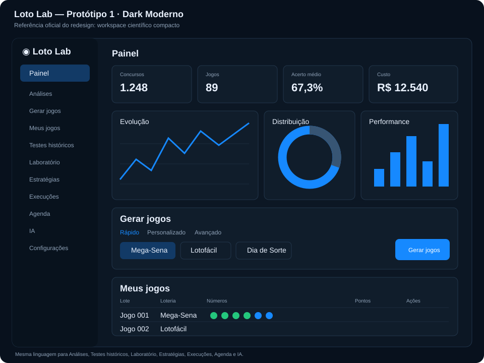

# Protótipo 1 — Dark Moderno

> Direção oficial do redesign do Loto Lab. Decisão registrada em #120 e execução organizada em #121.

## Intenção

Workspace científico compacto para uso prolongado: escuro, técnico, moderno e com alta densidade controlada. A interface deve facilitar leitura, comparação e ação rápida sem parecer um dashboard genérico pesado.

## Regras visuais

- fundo geral azul-preto muito escuro;
- superfícies azul-grafite com bordas discretas;
- azul vivo para ação, seleção e dado principal;
- verde reservado para sucesso/estado positivo;
- âmbar/vermelho apenas para atenção, risco ou erro real;
- sem gradientes decorativos e sem glow excessivo;
- radius discreto;
- sombras/elevation mínimos;
- tipografia funcional mínima de 16px;
- títulos contidos e métricas numericamente fortes;
- tabelas densas, gráficos técnicos e filtros compactos.

## Shell

### Desktop

- sidebar persistente à esquerda;
- item ativo com fundo azul discreto;
- conteúdo principal usa bem a largura disponível;
- topbar mínima e contextual;
- páginas compartilham o mesmo grid e ritmo vertical.

### Mobile

- não reproduzir a sidebar como coluna comprimida;
- usar drawer ou navegação compacta apropriada;
- cards/tabelas devem se reorganizar por prioridade, não apenas empilhar;
- ação principal permanece visível e alcançável.

## Componentes base

- Button / IconButton;
- Tabs / Segmented Control;
- Card / Panel;
- Metric;
- Input / Select / Checkbox / Radio;
- Badge / Status;
- Table;
- Dialog / Drawer;
- Empty / Loading / Error / Success;
- LotteryBall;
- chart surface, legend e tooltip.

## Hierarquia

1. estado atual / resultado principal;
2. ação principal;
3. comparação/evidência;
4. filtros e controles;
5. detalhes avançados por progressive disclosure.

## Cobertura obrigatória

A linguagem não pode variar por feature. Deve cobrir:

- Painel;
- Análises;
- Gerador;
- Meus Jogos / Apostas Reais;
- Testes históricos;
- Laboratório;
- Estratégias;
- Execuções;
- Agenda / Operações;
- IA;
- dialogs/drawers;
- tabelas, gráficos e formulários;
- loading, empty, error e success.

## Ordem de rollout

1. Foundations / Design System;
2. Shell e navegação;
3. Painel;
4. Análises;
5. Gerador;
6. Meus Jogos / Apostas Reais;
7. Testes históricos / Laboratório / Estratégias;
8. Execuções / Agenda / Operações / IA;
9. consolidação e remoção do legado visual.

## Guardrails de implementação

- esta referência é fonte de verdade, não apenas inspiração;
- não misturar linguagem dos protótipos descartados;
- não mudar backend/domínio por conveniência visual;
- manter desktop, mobile, teclado, contraste e reduced-motion como requisitos;
- PRs pequenos por foundation/superfície;
- cada PR: CI/E2E verdes + auto code review final no SHA exato antes do merge;
- qualquer desvio visual relevante deve ser decidido em #120 antes da implementação.

Relacionadas: #60, #64, #120, #121.
